# Tefcha

**T**ext to **F**low**ch**art.

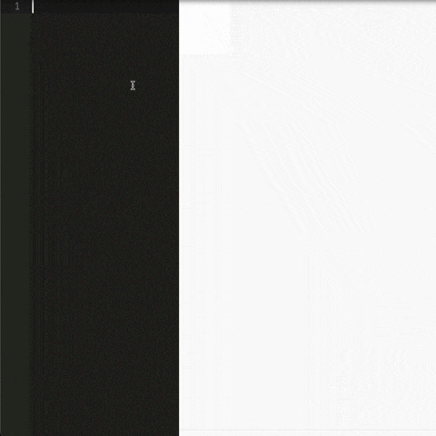

## Demo

### Rich Editor
* [https://hrhr49.github.io/tefcha/examples/rich-editor/dist](https://hrhr49.github.io/tefcha/examples/rich-editor/dist)

### Simple Editor
* [https://hrhr49.github.io/tefcha/demo](https://hrhr49.github.io/tefcha/demo)


## Feature
* Convert pseudo code to flowchart image.

## Installation

### CDN

```html
<script src="https://unpkg.com/tefcha/umd/tefcha.js"></script>
```

### npm

```sh
npm install tefcha
```

### CLI Tool

You can use command line interface also.
https://github.com/hrhr49/tefcha-cli

```sh
npm install tefcha-cli
```

## Supported

Only these features are supported for now

* if, elif, else statements
* switch-case statement
* while, do-while statements
* break, continue statement
* try-except statement

## Not Supported (for now)

* for statement
* return statement

## Reserved Word
* if, elif, else, while, do, for, continue, break, switch, case, pass, try, except

## Usage

1. Add `<div class="tefca">` tag in HTML file.
2. Write psedo code in `<div class="tefca">` tag.
3. Load `umd/tefcha.js` by script tag.
4. Call `tefcha.initialize()`, then, svg element will be generated.

### Simple Example.

```html
<!DOCTYPE html>
<html>

<head>
  <meta charset="UTF-8">
</head>

<body>
  <div class="tefcha">
# This is a example.
# NOTE:
#   The line starts with "#" is comment.
#   "\n" is newline.
#   All indent must be "  " (2 white spaces).

Start\nFizzBuzz!
i = 1

while i <= 100
  if i % 15 == 0
    print("FizzBuzz")
  elif i % 3 == 0
    print("Fizz")
  elif i % 5 == 0
    print("Buzz")
  else
    print(i)
  i = i + 1
End
  </div>
  <script src="https://unpkg.com/tefcha/umd/tefcha.js"></script>
  <script>
    tefcha.initialize();
  </script>
</body>

</html>
```

### Simple Example Result

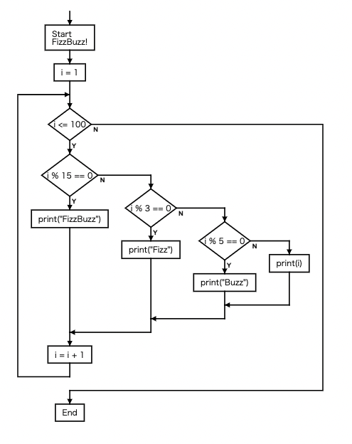

## Configuration

You can pass a custom configuration to `tefcha.initialize()`.

See

* [./src/config.ts](src/config.ts)
* [./demo/index.html](./demo/index.html)

### Configuration Example

```html
<!DOCTYPE html>
<html>

<head>
  <meta charset="UTF-8">
</head>

<body>
  <div class="tefcha">
# This is a example.
# NOTE:
#   The line starts with "#" is comment.
#   "\n" is newline.
#   All indent must be "  " (2 white spaces).

Start\nFizzBuzz!
i = 1

while i <= 100
  if i % 15 == 0
    print("FizzBuzz")
  elif i % 3 == 0
    print("Fizz")
  elif i % 5 == 0
    print("Buzz")
  else
    print(i)
  i = i + 1
End
  </div>
  <script src="https://unpkg.com/tefcha/umd/tefcha.js"></script>
  <script>
    var blueConfig = {
      text: {
        attrs: {
          'font-size': '14px',
          'stroke': 'white',
          'fill': 'white',
          'fill-opacity': '100%',
          'stroke-width': '0px',
        },
      },
      label: {
        attrs: {
          'font-size': '10px',
          'stroke': 'royalblue',
          'fill': 'royalblue',
          'fill-opacity': '100%',
        },
      },
      path: {
        attrs: {
          'stroke': 'dimgray',
          'stroke-width': '2px',
          'fill-opacity': '0%',
        },
      },
      rect: {
        attrs: {
          'stroke': 'steelblue',
          'stroke-width': '2px',
          'fill': 'steelblue',
          'fill-opacity': '100%',
          'rx': '3px',
          'ry': '3px',
        },
      },
      diamond: {
        attrs: {
          'stroke': 'royalblue',
          'stroke-width': '2px',
          'fill': 'royalblue',
          'fill-opacity': '100%',
        },
      },
      arrowHead: {
        attrs: {
          'stroke': 'dimgray',
          'stroke-width': '2px',
          'fill': 'dimgray',
          'fill-opacity': '100%',
        },
      },
    };
    tefcha.initialize(blueConfig);
  </script>
</body>

</html>
```

### Configuration Example Result
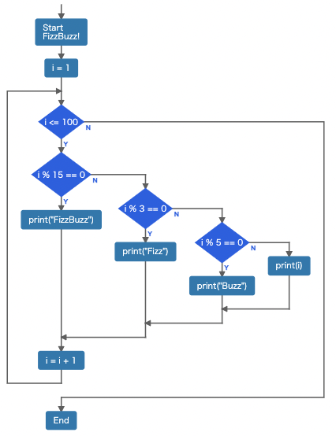

## Syntax

### Statement

If text is not started with reserved word, it means simple statement.
It is rendered as a box with the text.

```
hello
```
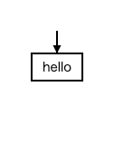

### Newline

You can use `\n` for newline.

```
hello\nworld
```

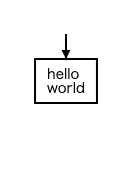

### If Statement

* text starts with `if` means if statement.
* indented line means block.

```
if score > 80
  good!

end
```

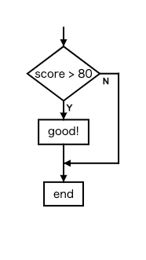

### If-elif Statement

You can use `elif` and `else` also.

```
if score > 80
  good!
elif score > 30
  soso
else
  bad!

end
```

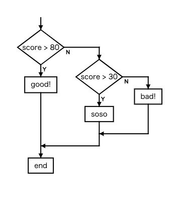

### Switch-Case Statement

You can use switch-case statement by `switch` block and `case` block.

NOTE: Unlike switch-case in C language, you cannot use "break" at the end of case block.

```
switch fruit
  case apple
    red
  case banana
    yellow
  case grape
    purple
end
```

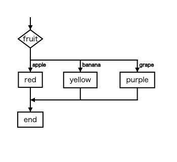

### While Statement

* text starts with `while` means while statement.

```
while score < 30
  study again

end
```
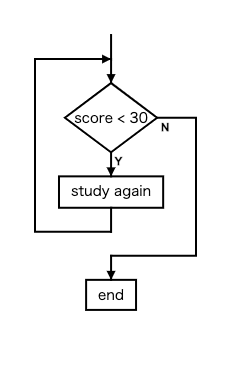

### Do While Statement

* text starts with `do` means do-while statement.
* after `do` block, line starts with `while` is needed.

```
do
  get input from user
while input is invalid

end
```
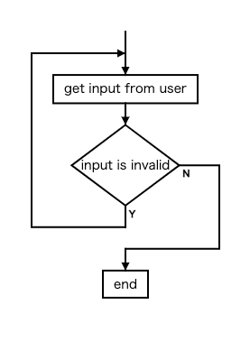


### Break

You can break loop by `break` keyword.

```
i = 0

while i < n
  if fruits[i] == 'apple'
    break
  i = i + 1
end
```
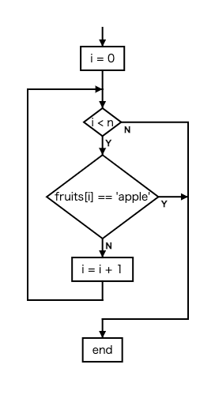

### Continue

You can use `continue` keyword also.

```
i = 0

while i < n
  if user[i] is null
    continue
  register user[i]
  i = i + 1

end
```
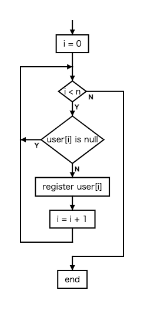

### Try-Except

You can use `try`, `except` keyword also.
It's syntax is similar to Python (a kind of programming language).

```
try
  calculate()
except ValueError
  invalid value
except ZeroDivisionError
  value must be != 0
end
```
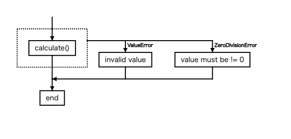

## Author

hrhr49

hiro49410@gmail.com

## License
MIT

## Links

* GitHub Page: https://github.com/hrhr49/tefcha
* NPM Page: https://www.npmjs.com/package/tefcha
